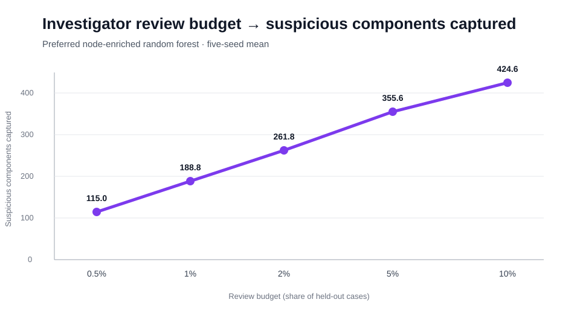
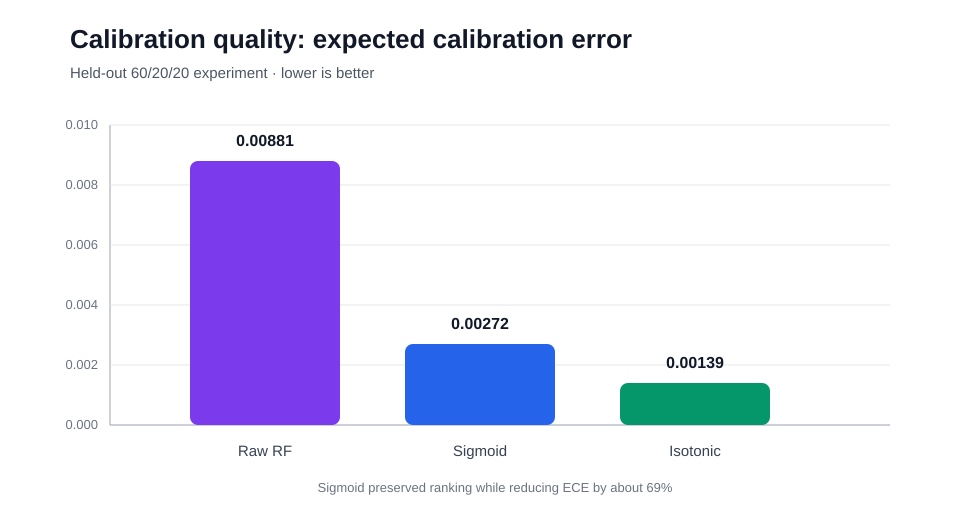
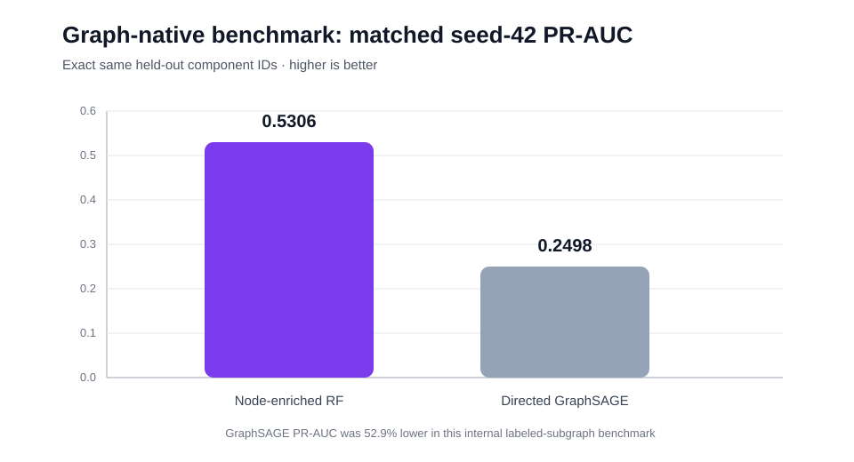
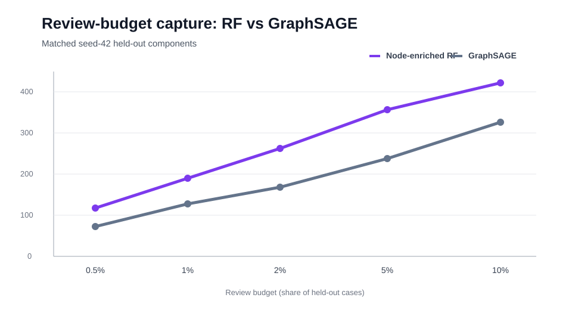

# Financial Crime Risk Intelligence

**Elliptic2 blockchain AML → scalable feature engineering → constrained-review model selection → calibrated decision support → investigator evidence → graph-native benchmark**

Financial Crime Risk Intelligence is an investigator-oriented anti-money-laundering analytics project built on the public **Elliptic2** transaction graph. The project asks a practical question:

> Given a very large, highly imbalanced transaction network, which connected transaction patterns should investigators review first, why were they prioritized, and how much suspicious activity can be captured under a constrained review budget?

The project is intentionally framed as **research decision support**, not automated enforcement. Scores prioritize human review; they do not establish criminal activity, make legal determinations, or automate regulatory reporting.

## Verified data scale

The locally downloaded Elliptic2 release used in this project contains:

| Table | Verified rows |
|---|---:|
| Background nodes | 49,299,864 |
| Background transaction edges | 196,215,606 |
| Labeled connected components | 121,810 |
| Labeled nodes | 444,521 |
| Labeled edges | 367,137 |

The labeled universe contains **119,047 licit** and **2,763 suspicious** connected components, so suspicious cases represent only about **2.27%** of the labeled population.

> The repository does **not** redistribute Elliptic2. Download the dataset from its original Kaggle source and follow its license terms.

## What the project demonstrates

### 1. Structure alone is not enough

A 19-feature structural benchmark using connected-component topology performed only slightly above random:

| Structural model | PR-AUC | ROC-AUC |
|---|---:|---:|
| Logistic regression | 0.0263 | 0.5460 |
| Random forest | 0.0241 | 0.5129 |

This establishes a deliberately weak baseline: graph size, degree, density, and related topology alone do not provide enough prioritization signal.

### 2. Node features create the dominant signal

All **444,521 labeled nodes** matched exactly once to the 49.3M-row background-node table. The 43 anonymized node features were aggregated by mean, population standard deviation, minimum, and maximum, adding **172 component-level node features** with zero missing labeled nodes and zero duplicate background matches.

Across five stratified 80/20 splits, the preferred **node-enriched random forest** produced:

| Validation measure | Result |
|---|---:|
| Mean PR-AUC | **0.5279** |
| PR-AUC SD | **0.0081** |
| Mean ROC-AUC | **0.9278** |
| Mean Brier score | **0.0150** |
| Shuffled-label PR-AUC | **0.0210** |
| Test prevalence | **0.0227** |

The shuffled-label sanity check collapsed to chance-level performance, while schema-leakage and feature-dominance checks passed.

### 3. The investigator queue remains strong under tight review budgets

The project evaluates the model where AML work is actually constrained: the number of cases an investigator team can review.

| Review budget | Mean precision | Mean recall | Mean lift | Mean suspicious captured |
|---|---:|---:|---:|---:|
| Top 0.5% | **94.26%** | 20.80% | **41.53×** | **115.0** |
| Top 1% | 77.38% | 34.14% | 34.09× | 188.8 |
| Top 2% | 53.65% | 47.34% | 23.63× | 261.8 |
| Top 5% | 29.17% | 64.30% | 12.85× | 355.6 |
| Top 10% | 17.42% | 76.78% | 7.68× | 424.6 |

At the tightest tested operating point, roughly **115 suspicious components are captured in about 122 reviews on average** across the five validation splits.

### 4. More features did not automatically create more decision value

The **367,137 labeled edges** were matched exactly against the 196.2M-row background-edge table using the full `(clId1, clId2, txId)` key. All 95 anonymized edge features were aggregated into **380 additional component-level features** with zero missing labeled edges, zero duplicate matches, and zero null edge aggregates.

Despite that substantial engineering effort, the combined node+edge random forest performed worse:

| Random forest | Node only | Node + edge |
|---|---:|---:|
| Mean PR-AUC | **0.5279** | 0.5022 |
| PR-AUC SD | **0.0081** | 0.0171 |
| Mean ROC-AUC | **0.9278** | 0.9247 |
| Mean Brier score | **0.0150** | 0.0157 |

The node+edge model is essentially tied at the top 0.5% review point and worse from 1% through 10%. The project therefore keeps the **node-enriched random forest** as the preferred model and treats the edge experiment as a validated negative incremental-value result.

### 5. Ranking and probability are treated as different products

The raw random-forest output is retained as an **investigator ranking score**, not presented as a literal suspicious-activity probability.

A strict 60/20/20 train/calibration/test experiment compared raw, sigmoid, and isotonic scores:

| Method | PR-AUC | Brier | Log loss | ECE |
|---|---:|---:|---:|---:|
| Raw random forest | 0.5074 | 0.01534 | 0.07255 | 0.00881 |
| Sigmoid calibration | **0.5074** | 0.01533 | 0.06866 | **0.00272** |
| Isotonic calibration | 0.4813 | **0.01516** | **0.06521** | **0.00139** |

Sigmoid calibration preserves the ranking exactly while materially improving ECE and log loss, so it may be used as an **optional research probability estimate**. Isotonic calibration is not selected for operational ranking because it degrades PR-AUC and the smallest-budget capture.

### 6. Graph complexity did not beat the simpler validated model

A directed dual-channel GraphSAGE classifier was trained on the compact labeled-subgraph graph: **444,521 nodes, 367,137 directed edges, 121,810 components, and all 43 node features**. Seed 42 was required to use the exact same held-out component IDs as the existing random-forest benchmark.

| Matched seed-42 model | PR-AUC | ROC-AUC |
|---|---:|---:|
| Node-enriched random forest | **0.5306** | **0.9266** |
| Directed GraphSAGE | 0.2498 | 0.8702 |

GraphSAGE PR-AUC is **52.9% lower** than the random forest on the matched test set. It also captures fewer suspicious components at every tested review budget:

| Review budget | RF captured | GraphSAGE captured |
|---:|---:|---:|
| Top 0.5% | **117** | 72 |
| Top 1% | **190** | 127 |
| Top 2% | **262** | 168 |
| Top 5% | **357** | 238 |
| Top 10% | **421** | 326 |

This is retained as a **negative-complexity benchmark**: explicit graph message passing added modeling complexity but did not create more investigator value in the labeled-subgraph setting. Because the performance gap is large, the GraphSAGE model is not promoted to repeated-seed model selection.

## Visual proof of validated results

The charts below are committed README assets built only from verified project outputs. Repeated-validation and matched seed-42 results are labeled separately to avoid implying they come from the same experiment.

### Investigator capture under constrained review capacity



### Calibration quality



### Matched seed-42 RF vs GraphSAGE PR-AUC



### Matched seed-42 review-budget capture



## Investigator-facing evidence

The queue uses review-capacity tiers instead of arbitrary probability-like cutoffs:

- top 0.5%,
- 0.5–1%,
- 1–2%,
- 2–5%,
- 5–10%,
- standard.

Each queued component can be enriched with three case-specific statistical review cues. The evidence layer:

1. starts from the globally important random-forest node features;
2. measures each queued component's percentile and standardized deviation for those features;
3. ranks candidate cues using `global feature importance × absolute standardized deviation`;
4. reports the feature value, percentile, z-score direction, and global importance.

The source features are anonymized, so the project does **not** invent semantic meanings for them. These cues describe unusual model-relevant measurements; they are not causal explanations or proof of suspicious activity.

A verified explained queue contains **24,362 held-out components** and **73,086 structured evidence rows**—exactly three cues per queued component.

## End-to-end architecture

```text
Elliptic2 raw CSVs
    |
    +--> inspect/profile schema and labeled-universe integrity
    |
    +--> build structural component features
    |
    +--> out-of-core node enrichment (49.3M background nodes)
    |       |
    |       +--> logistic regression + random forest
    |       +--> repeated-split / permutation / leakage validation
    |       +--> preferred node-only random forest
    |
    +--> out-of-core edge enrichment (196.2M background edges)
    |       |
    |       +--> node+edge ablation
    |       +--> rejected for incremental operational value
    |
    +--> held-out calibration comparison
    |
    +--> capacity-ranked investigator queue
    |
    +--> case-specific statistical evidence
    |
    +--> compact labeled-subgraph GraphSAGE benchmark
    |       |
    |       +--> exact seed-42 RF test-component match
    |       +--> rejected for model-selection value
    |
    +--> Seaborn static + Plotly interactive decision views
```

## Key repository outputs

- `reports/CURRENT_FINDINGS.md` — verified project findings
- `reports/MODEL_VALIDATION.md` — model-validation framing
- `reports/CALIBRATION_DECISION.md` — ranking vs probability decision
- `reports/GRAPH_NATIVE_BENCHMARK.md` — completed GraphSAGE benchmark and decision
- `PROJECT_STATUS.md` — current project state
- `results/node_enriched/` — preferred single-split benchmark outputs
- `results/node_enriched_validation/` — repeated validation and leakage checks
- `results/node_calibration/` — calibration comparison outputs
- `results/node_edge_enriched_validation/` — edge-feature ablation
- `results/graph_native/` — graph-native benchmark outputs
- `results/node_enriched/investigator_queue_explained.csv` — investigator-facing queue with case evidence
- `results/node_enriched/investigator_evidence_long.csv` — structured evidence for analysis and visualization

Generated result files and figures are intentionally ignored by Git; the code needed to reproduce them is versioned. The small SVG files under `docs/readme/` are committed intentionally so GitHub can render proof-of-results charts directly in this README.

## Visualization standard

Project visualizations are standard **2D Seaborn and Plotly** charts:

- Seaborn → presentation-ready static `.png` figures
- Plotly → interactive `.html` counterparts with hover and zoom

Current figure generators cover:

- review-budget lift and capture,
- feature-stage model comparison,
- node-only vs node+edge model selection,
- calibration quality and ranking trade-offs,
- global feature importance,
- top-priority evidence frequency,
- case-level evidence heatmaps,
- evidence strength across queue rank,
- RF vs GraphSAGE model quality and review-budget capture.

## Reproduce the validated workflow

Install the project:

```bash
python -m pip install -e ".[dev]"
```

For a lightweight repository smoke test:

```bash
python run_pipeline.py --fixture
pytest
```

For the full Elliptic2 analysis, use the staged scripts rather than a single full-raw-data command so the very large CSVs are scanned only when necessary. The main stages are:

```bash
python src/build_feature_store.py --raw-dir data/raw/elliptic2
python src/enrich_node_features.py --raw-dir data/raw/elliptic2
python src/train_baselines.py --input data/derived/component_features_node_enriched.parquet --results-dir results/node_enriched
python src/validate_node_enriched_models.py
python src/enrich_edge_features.py --raw-dir data/raw/elliptic2
python src/validate_rf_calibration.py
python src/build_investigator_queue.py --scores results/node_enriched/model_scored_cases.csv --output results/node_enriched/investigator_queue.csv
python src/build_investigator_evidence.py
python src/generate_model_selection_figures.py
python src/generate_calibration_figures.py
python src/generate_explainability_figures.py
```

The optional graph-native benchmark uses the compact labeled-subgraph graph and does not require another scan of the 196.2M background-edge CSV:

```bash
python -m pip install -e ".[graph]"
python src/prepare_graph_native_dataset.py --raw-dir data/raw/elliptic2
python src/train_graph_native_baseline.py --seeds 42 --device cpu
python src/generate_graph_native_figures.py
```

## Evaluation philosophy

Because the labeled dataset is severely imbalanced and investigation capacity is constrained, **PR-AUC is the primary global metric**. ROC-AUC is reported as a secondary diagnostic. Operational evaluation emphasizes:

- precision at constrained review budgets,
- recall at constrained review budgets,
- lift versus random review,
- suspicious components captured,
- false-positive workload,
- repeated-split stability,
- permutation sanity,
- calibration quality,
- evidence transparency,
- incremental decision value relative to model complexity.

## External research benchmark

The Elliptic2 paper reports graph-native results such as GLASS under its published evaluation setup. Those literature results remain separate from this project's measured GraphSAGE and random-forest results because graph scope, split design, feature usage, and training procedures differ. The internal GraphSAGE benchmark uses only the compact labeled-subgraph universe and must not be described as a GLASS reproduction.

## Compliance and governance framing

This is a public research and portfolio project. It does not identify real people, make accusations, file SARs, make legal determinations, or claim that a model score proves criminal behavior. The preferred output is an **auditable human-review priority queue** with explicit workload trade-offs and statistical evidence cues.

## Data and research sources

See `sources/SOURCE_REGISTER.md` for the dataset, implementation references, research paper, and regulatory sources.